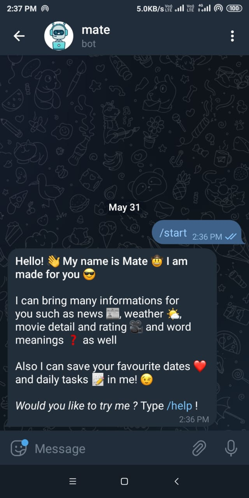

  

<a href="http://t.me/iAmAlbusYourMate_bot"><h1 align="center">mate</h1></a>

<h2 align="center"> A friendly bot which can bring news, weather for you and save your daily tasks </h2>

<h3>Some of the commands with examples</h3>

- /start : Bot will introduce itself

 
 

--- 

- /help : Bot will tell you, how you can use it

 

---

- /news [football] : This command will give top 10 news of "football"

 

---

- /weather [city] : This command will weather report of given city"

 

---

<h3>Tech Stacks</h3>

- NodeJS for server/backend
- MongoDB, Mongoose for database
- Heroku for deployment

--- 

<h3>Find the bot <a href="http://t.me/iAmAlbusYourMate_bot">here</a>, or search on Telegram with name, iAmAlbusYourMate_bot</h3>